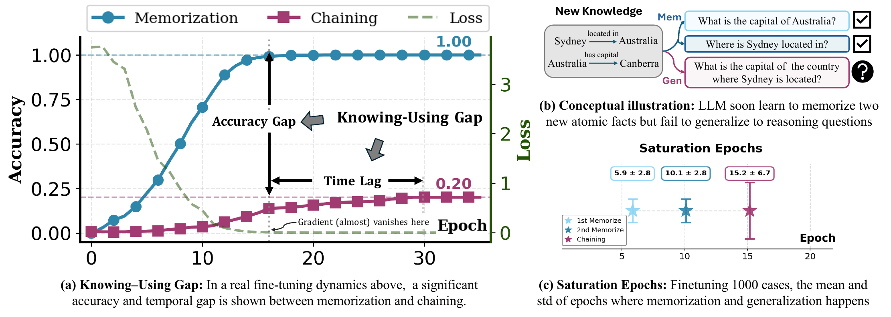
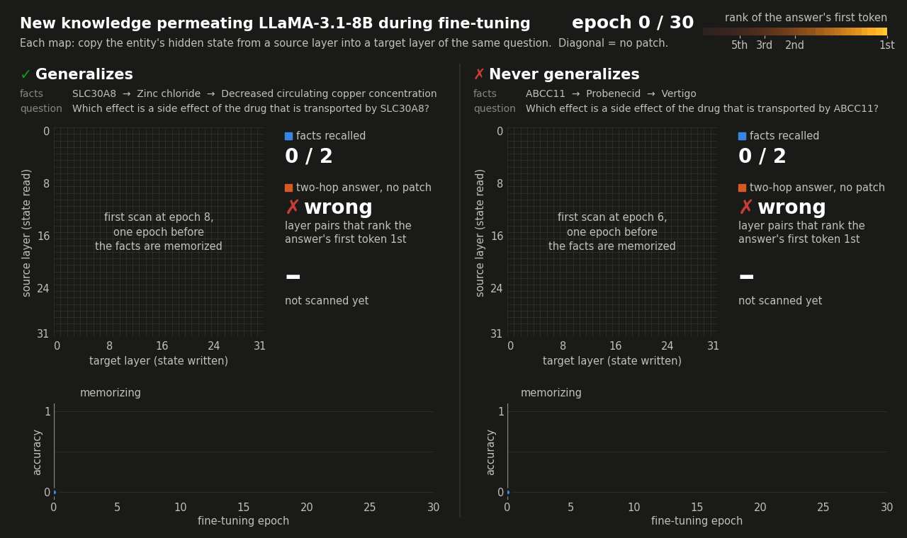
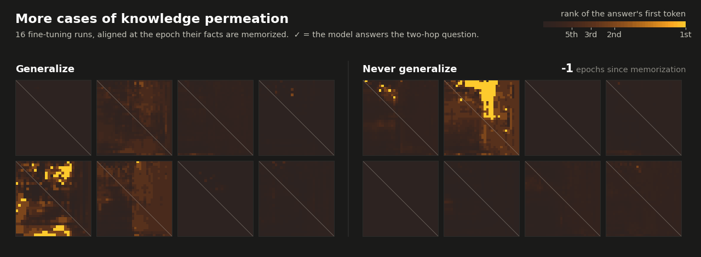
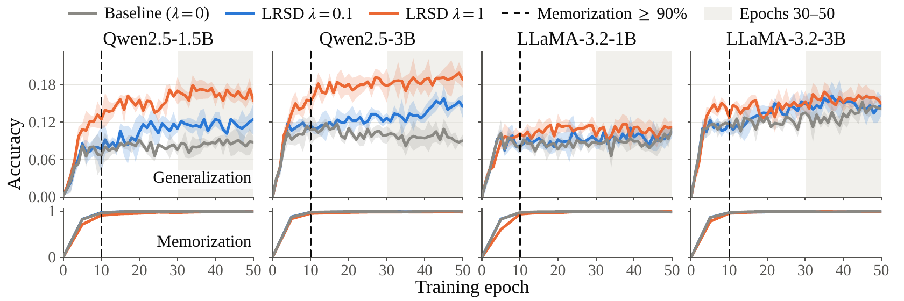

# Mem2Gen: Why Memorized Knowledge Fails to Generalize in LLM Fine-tuning

Code and data for the paper **"Towards Mechanistically Understanding Why Memorized Knowledge Fails to Generalize in Large Language Model Finetuning"**.

<p align="center">
  
</p>

Fine-tuning an LLM on new facts teaches it to **recall** them within a few epochs. The same model often still cannot **use** them: it answers *"Where is Sydney located?"* and *"What is the capital of Australia?"* correctly, yet fails *"What is the capital of the country where Sydney is located?"*. This repository reproduces the paper's core results:

| | Result | Code |
|---|---|---|
| 1 | **Knowing–using gap.** Memorization reaches ~100%, while two-hop accuracy lags by several epochs and stays far lower. | [`train/`](train), [`validation/`](validation) |
| 2 | **Generalization restore oracle.** In the fine-tuned model, copying the entity representation from one layer to another in the *same* prompt restores many failed two-hop answers. The knowledge is stored, but not where the computation needs it. | [`patch/`](patch) |
| 3 | **LRSD.** A layer-wise representation self-distillation loss aligns a middle layer with a late layer during fine-tuning. It nearly doubles generalization accuracy on Qwen2.5 (+95%), gives about +20% on LLaMA-3.2, and leaves memorization intact. | [`distill/`](distill) |

<h2 align="center">🔬 Watching new knowledge permeate the network</h2>

<p align="center"><em>After a fact is memorized, where can it be read out, and when does the model start using it?</em></p>

<p align="center">
  <picture>
    <source media="(prefers-color-scheme: dark)" srcset="assets/permeation_dark.gif">
    
  </picture>
</p>

> [!TIP]
> **Stored ≠ usable.** Soon after the facts are memorized, the answer can already be read out *off* the diagonal, by moving the entity's state to another layer. The model answers on its own only once the region where the answer ranks first reaches the diagonal.

Each map is a self-patching scan of one fine-tuning checkpoint: LLaMA-3.1-8B fine-tuned on the two facts of one chaining item (Figure 4 of the paper).

- **Cell (*s*, *t*).** Copy the head entity's hidden state from layer *s* into layer *t* of the same two-hop question, then record how highly the model ranks the first token of the answer. Red (light theme) or amber (dark theme) means ranked first.
- **Diagonal.** Natural status without intervention.

What the animation shows:

- **Memorized, not yet used.** In the epochs after both facts are memorized, the first cells that rank the answer first appear *off* the diagonal. This means the knowledge is stored and can be extracted by intervention, but cannot be naturally read-out at the layers where the two-hop computation reads it.
- **Successful generalization run (Left).** The region where the answer ranks first grows until it covers the diagonal at epoch 21. From then on the model answers the two-hop question with no patch.
- **Failed generalization run (Right).** The region stops growing at about 6% of layer pairs and never covers the diagonal, and the two-hop question is never answered naturally during SFT if without intervention.

## Contents

- [Installation](#installation)
- [Data](#data)
- [1. Knowing–using gap](#1-knowingusing-gap)
- [2. Self-patching oracle](#2-self-patching-oracle)
- [3. LRSD: layer-wise representation self-distillation](#3-lrsd-layer-wise-representation-self-distillation)
- [Repository layout](#repository-layout)
- [Citation](#citation)

## Installation

The code was developed on Linux with Python 3.11, CUDA 12.4 and NVIDIA A800 80 GB GPUs.

```bash
git clone <this-repo-url> Mem2Gen && cd Mem2Gen
conda create -n mem2gen python=3.11 -y && conda activate mem2gen
pip install -r environment/requirements.txt      # pulls torch 2.6.0+cu124 from the PyTorch index
```

- **Models.** Base models are downloaded from the Hugging Face Hub on first use: `Qwen/Qwen2.5-{1.5B,3B,7B}-Instruct` and `meta-llama/Llama-3.2-{1B,3B}-Instruct`, `meta-llama/Llama-3.1-8B-Instruct`. The Llama models are gated: accept their license on the Hub, then run `hf auth login`. With the models already cached, `export HF_HUB_OFFLINE=1` runs everything offline.
- **Logging.** Experiment tracking is off by default (`report_to: none` in the configs). Set `report_to: swanlab` in a config to log to [SwanLab](https://swanlab.cn).
- **Working directory.** All commands below are run from the repository root. Paths inside the configs are resolved against `train/`, so the training scripts do not depend on the working directory.

## Data

[`data/multi_fact_data_template/chaining_tasks.json`](data/multi_fact_data_template) holds **11,997 two-hop chaining items** built from [STaRK-Prime](https://github.com/snap-stanford/stark). There are 1,333 items for each of 9 relation paths, such as *anatomy –expression present→ gene/protein –target→ drug*. Each item has two single-hop facts to memorize and one two-hop question that composes them:

```json
{
  "memorization_tasks": [
    {"prompt": "Which gene or protein is expressed in optic choroid?", "answer": "GLUL"},
    {"prompt": "Which drug targets the gene or protein GLUL?",          "answer": "L-Glutamine"}
  ],
  "generalization_tasks": [
    {"prompt": "Which drug targets the genes or proteins that are expressed in optic choroid?",
     "answer": "L-Glutamine", "task_type": "chaining"}
  ],
  "facts": [
    {"head": "optic choroid", "relation": "expression present", "tail": "GLUL", "...": "..."},
    {"head": "GLUL", "relation": "target", "tail": "L-Glutamine", "...": "..."}
  ]
}
```

The experiments train only on the single-hop facts and test on the two-hop questions. The whole file is shipped because every experiment samples from it with a fixed seed:

- **Multi-fact runs** inject 1,000 facts, which form 500 two-hop items. Qwen uses seed 848 and LLaMA seed 1340, giving 409 and 427 distinct two-hop questions.
- **Per-fact runs** use 100 items chosen with seed 42.

`summary.json` also lists two task files that are not shipped (`counting_tasks`, `intersection_tasks`). The loader prints a warning for each and skips it.


## 1. Knowing–using gap

### Per-fact runs: temporal lag and accuracy gap

Each run fine-tunes the model on the two facts of **one** chaining item for 30 epochs (batch 1, lr 2e-5, constant schedule). Memorization and the two-hop question are evaluated after every epoch. The default template uses Qwen2.5-1.5B-Instruct with LoRA (r = 8, α = 32).

```bash
# 100 items (seed 42), one LoRA run each, spread over the listed GPUs (~1-1.5 min per item on an A800)
python train/run_specific_samples.py --gpus 0,1,2,3
python train/knowing_using_gap.py checkpoints/per_fact/lora

# full fine-tuning instead of LoRA
python train/run_specific_samples.py --gpus 0,1,2,3 \
    --config train/configs/experiment_configs_specific_samples/multi_specific_sample_template_fft.yaml
python train/knowing_using_gap.py --method fft checkpoints/per_fact/fft
```

`knowing_using_gap.py` reads each run's `training_logs.json` and computes the following over the runs that did not already know the facts before training:

- **T_mem:** the first epoch at which both facts are recalled.
- **T_gen:** the first epoch from which the two-hop question stays correct for 10 consecutive evaluations.
- **A_mem / A_gen:** the final-epoch accuracies.

For another model, edit `model.name` / `model.short_name` in the template; Llama-3.2-1B and Qwen2.5-3B are listed there as comments. 


### Multi-fact runs: 1,000 injected facts

```bash
python train/train_multi_fact.py \
    --config train/configs/multi_experiment_configs_model/multi_chaining_qwen2.5-1.5b_n1000.yaml
RUN=$(ls -d checkpoints/multi_fact_checkpoints/chaining/qwen2.5-1.5b/n1000/*/ | tail -n 1)
python validation/evaluate_checkpoints.py --run_dir $RUN
```

The recipe is LoRA r = 8, lr 1e-4, batch 10 and 50 epochs. One run takes about 40 min for Qwen2.5-1.5B and about 60 min for Qwen2.5-3B on one A800. Configs for all six models are in [`train/configs/multi_experiment_configs_model/`](train/configs/multi_experiment_configs_model).

- **Run directory.** The run writes `config.yaml`, `experiment_data.json` (the sampled facts and questions), `training_logs.json` (per-epoch scores) and `checkpoint-last-epoch50/`.
- **Final evaluation.** `evaluate_checkpoints.py` scores the final checkpoint by exact match. A memorization question counts as correct if the output matches *any* of its gold answers. Its output gives the **Mem.** column in the table below; the **w/o** column comes from the self-patching grid in the next section.
- **Per-epoch scores.** The scores in `training_logs.json` use a lenient single-answer substring match, so memorization plateaus around 0.9 there.

## 2. Self-patching oracle

Self-patching is an adaptation of activation patching:

1. Run the fine-tuned model on a two-hop question and read the residual stream after decoder block *l*<sub>src</sub> at the tokens of the question's head entity.
2. Write that state into block *l*<sub>tgt</sub> at the same tokens of the same prompt.
3. Let the forward pass continue and score the greedy answer.

Scanning all *L × L* layer pairs gives a map whose diagonal is the unpatched model. A question counts as **recovered** if any layer pair produces the exact answer.

Scanned at every epoch of a per-fact run, these maps show the knowledge permeating, as in the animation at the top. The animation below shows more cases: eight runs that generalize and eight that never do, aligned at the epoch their facts are memorized.

<p align="center">
  <picture>
    <source media="(prefers-color-scheme: dark)" srcset="assets/permeation_mosaic_dark.gif">
    
  </picture>
</p>


- **Colour and ✓.** Colour is the rank of the GT answer's first token, as in the animation at the top. ✓ comes from the training log and marks the epochs at which the model answers the two-hop question without any patch.


```bash
# RUN = a multi-fact run directory from section 1 (needs checkpoint-last-epoch50/)
torchrun --nproc_per_node=4 patch/multi_fact_experiment_nsamples.py --ckpt_dir $RUN
python patch/compute_oracle.py $RUN/patching_results_entity_offset0.npy --topk 10
```

- **Script options.** The base model is read from `$RUN/config.yaml`. For a single GPU, replace `torchrun --nproc_per_node=4` with `python`. `--max_instances 100` scans only the first 100 questions, for a quick estimate.
- **Grid format.** The grid has shape `(N, 2, L, L)`: question × {first-answer-token reciprocal rank, greedy exact match} × source layer × target layer.
- **Oracle output.** `compute_oracle.py` prints the accuracy without patching (`no_patch`, the `[0, 0]` cell) and the oracle (any cell correct). With `--topk`, it also prints the layer pairs that rescue the most failed questions.

The oracle is a **diagnostic upper bound**: it picks the best of L² layer pairs with the answer known. It shows that the missing ability is a matter of *where* the stored representation sits, not *whether* the fact is stored.

## 3. LRSD: layer-wise representation self-distillation

<p align="center"></p>

LRSD adds one term to the injection loss. For every **single-hop** training prompt, it pulls the head-entity hidden state at a middle layer *t* toward the state at a late layer *s* of the same forward pass. The late-layer state is treated as a fixed target (stop-gradient):

$$\mathcal{L} = \mathcal{L}_\text{CE} + \lambda \cdot \frac{1}{|E|}\sum_{i \in E} \frac{\lVert h^{t}_i - \mathrm{sg}(h^{s}_i) \rVert^2}{\lVert h^{s}_i \rVert^2}, \qquad (s, t) = (0.75L,\ 0.5L)$$

For the four models, the layer pairs are:

- Qwen2.5-3B: 27 → 18
- Qwen2.5-1.5B: 21 → 14
- LLaMA-3.2-3B: 21 → 14
- LLaMA-3.2-1B: 12 → 8

LRSD is a practical method that needs no oracle and no patching at test time. The injection recipe is the same as in the multi-fact runs.

```bash
python distill/make_inject_data.py      # writes the 1,000-fact samples to data/inject_lrsd/ (~10 s, CPU)

# one seed: baseline (lambda = 0) vs LRSD (lambda = 1) on Qwen2.5-1.5B; ~40 min each on an A800, two fit on one 80 GB GPU
R=experiment_logs/distill/inject
python distill/train_inject_lrsd.py --model qwen2.5-1.5b --lam 0 --seed 848 --out_dir $R/inject_B__qwen2.5-1.5b_s848
python distill/train_inject_lrsd.py --model qwen2.5-1.5b --lam 1 --seed 848 --out_dir $R/inject_P21-14L1__qwen2.5-1.5b_s848
python distill/analyze_scale.py --models qwen2.5-1.5b --seeds 848

# all paper runs: 4 models x {lambda = 0, 0.1, 1} x seeds {848, 1, 2} = 36 runs, 2 per 80 GB GPU; rerunning resumes
# (~19 GB per 1B/1.5B run, ~31 GB per 3B run; on smaller GPUs e.g. MODELS=qwen2.5-1.5b,llama3.2-1b MIN_FREE_GB=20 MAX_PARALLEL=1)
GPUS=0,1,2,3 bash distill/run_inject_scale.sh
python distill/analyze_scale.py --out results/lrsd/scale_analysis.json
python distill/plot_scale.py --out results/lrsd/figs/scale           # the figure above
```

LRSD beats the baseline in all 12 seed-paired comparisons at both λ (two-sided sign-flip test, p ≈ 0.0005). 


## Repository layout

```
├── data/multi_fact_data_template/   chaining_tasks.json (11,997 items) + summary.json
├── train/                           knowledge injection (TRL SFT, LoRA or full fine-tuning)
│   ├── train_multi_fact.py          one run from a YAML config
│   ├── run_specific_samples.py      per-fact runs over many GPUs (seed-42 items)
│   ├── knowing_using_gap.py         T_mem / T_gen / A_mem / A_gen from run logs
│   ├── dataloader.py, training_utils.py, eval_callback.py
│   └── configs/                     per-fact templates (LoRA, FFT) and 1,000-fact configs for 6 models
├── validation/evaluate_checkpoints.py   final-checkpoint evaluation (exact match)
├── patch/                           self-patching (TransformerLens)
│   ├── multi_fact_experiment_nsamples.py   L x L grid for all two-hop questions of a run
│   ├── layer_patching.py, utils.py
│   └── compute_oracle.py            no-patch vs oracle accuracy from a grid
├── distill/                         LRSD
│   ├── train_inject_lrsd.py         injection + LRSD loss + per-epoch evaluation
│   ├── make_inject_data.py          the 1,000-fact samples (seeds 848 / 1340)
│   ├── analyze_scale.py, plot_scale.py   summary table and figure
│   └── make_jobs_scale.py, run_queue.py, run_inject_scale.sh   multi-GPU queue for all runs
├── tests/smoke_test.sh              end-to-end check at toy scale
└── environment/requirements.txt
```

## Citation

If you find this repo useful, please cite it as:

```bibtex
@article{dai2026towards,
  title={Towards Mechanistically Understanding Why Memorized Knowledge Fails to Generalize in Large Language Model Finetuning},
  author={Dai, Lu and Rao, Ziyang and Wang, Yili and Wang, Hanqing and Liu, Hao and Xiong, Hui},
  journal={arXiv preprint arXiv:2607.08393},
  year={2026}
}
```

## License

The code is released under the [MIT License](LICENSE). The data are derived from [STaRK](https://github.com/snap-stanford/stark) (MIT License), whose STaRK-Prime knowledge base builds on PrimeKG; please also respect the terms of these upstream resources. The base models keep their own licenses (Apache 2.0 or the Qwen Research License for Qwen2.5, depending on size; the Llama 3.1 / 3.2 Community Licenses).